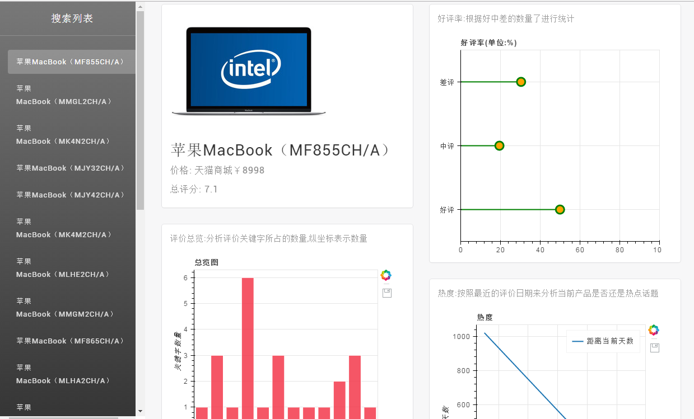

# ProductAnalysis

项目说明:

    主要是用来练习数据抓取和数据分析,并通过前端页面来显示分析结果,目前只抓取zol中的手机,笔记本,数码相机

使用步骤:

    1.先mysql数据创建数据库名为:productanalysis,数据库编码一定要设置成utf-8

    2.同步数据库:python manage.py makemigrations 和 python manage.py migrate

    3.进入app/ProductData/spiders目录,执行:scrapy crawl zol

    等待执行结束就可以了

用到技术点:

    1.通过django-haystack来实现全文搜索

    2.爬虫框架用的是分布式,通过redis来实行去重

    3.前端数据分析展示通过bokeh来实现

    4.数据分析用的是pandas

##  首页

##  分析结果页

