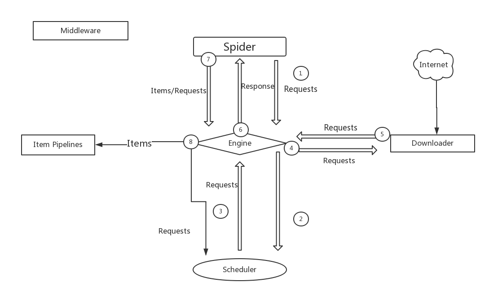

# 官方文档:https://doc.scrapy.org/en/master/topics/architecture.html

## 数据抓取流程

### 各个组件的功能:

>   1.Engine:引擎,图中它是位于中间的位置,所以它的主要功能就是用来提供Spider,ItemPipelines,Scheduler,Downloader之间通信的渠道

>   2.Scheduler:调度器,负责接收Engine发送过来的Request,按照一定的形式进行排列,并将Request返回给引擎

>   3.Downloader:下载器,负责下载Engine里所有的Request,然后将获取到的Response交给Engine

>   4.Spider:负责发送Request和接收Response,对Response里的数据进行提取,分析,如果有需要跟进的URL,再次将这个Request交给Engine

>   5.Item Pipeline:管道,负责处理Spider中数据,并对这些数据进行处理,比如将数据存储到数据库

>   6.Middlewares:中间件,包括Downloader Middlewares 和 Spider Middewares,有的时候需要对一些请求进行处理,比如添加请求头,设置动态代理,那么这个任务就可以交给Downloader Middlewares来完成,同时,当Downloader下载
完成将Response返回给Engine的时候,这个时候Downloader Middlewares也可以对Response进行一定的处理;对于Spider Middlewares,如果需要在Spider和Engine之间的的Request和Response进行扩展的话,可以通过Spider Middewares来实现

### 流程
>   对于流程的话,就是按照上图那样进行的,我感觉需要解释的就是第八步,第八步那里为什么会有两个指向箭头呢?当一个Spider完成了第六步之后,也就是接收到了
Response,可以说,这个时候完成了一次请求,这个时候有两种情况就是,这个Response处理完的结果一种是需要Item Pipeline处理数据,一种还有就是里面有需要跟进的URL,比如分页,所以就把需要进行数据处理的交给Item Pipeline,需要跟进的URL交给Scheduler,由Scheduler将这个URL加入队列进行处理